#1주차 수업 (OT)

#2주차 수업 완료 + 추가 문제 구현 완료

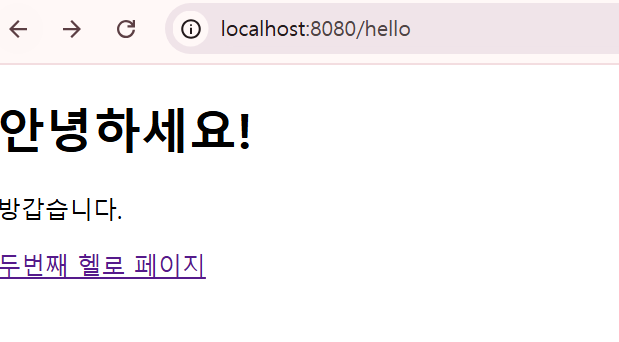, 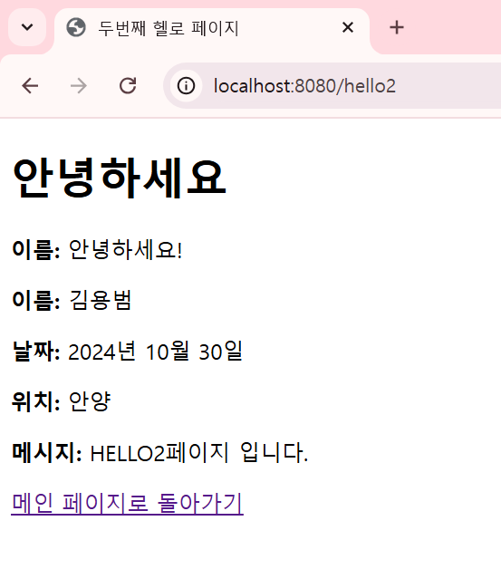, 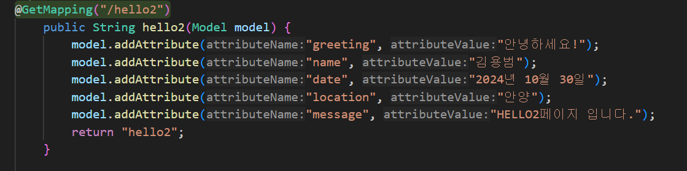

#3주차 수업 완료 + 추가 문제 구현 완료

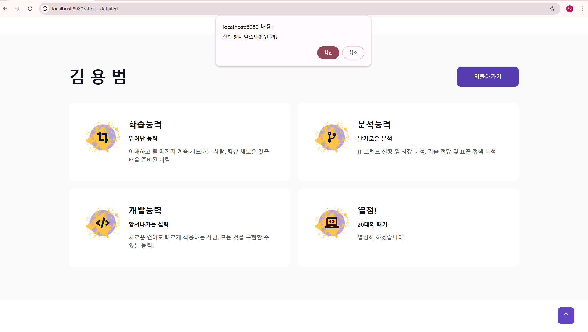, 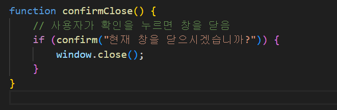

#4주차 수업 완료 + 추가 문제 구현 완료

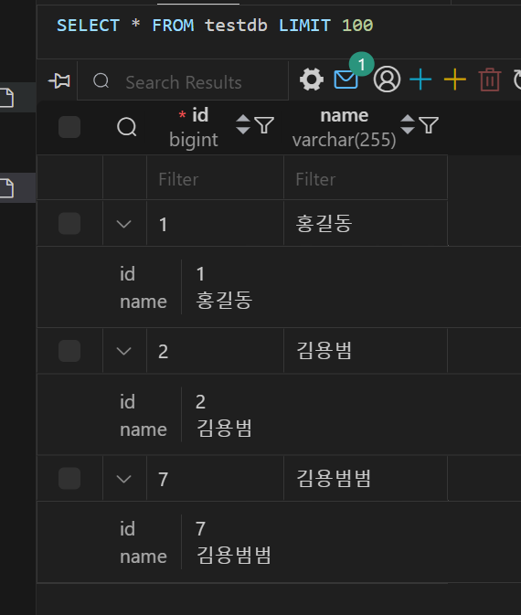

#5주차 수업 완료 / 추가 문제 구현 실패 ...

#6주차 수업 완료 + 추가 문제 구현 완료

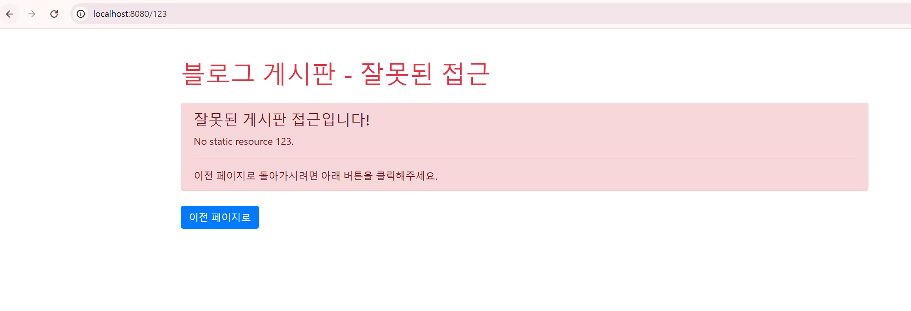, 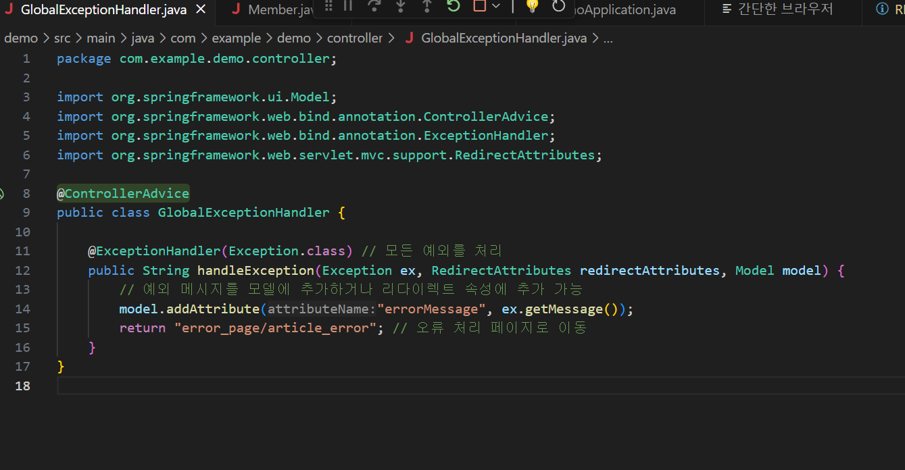

#7주차 수업 완료 + 추가 문제 구현 완료

수정
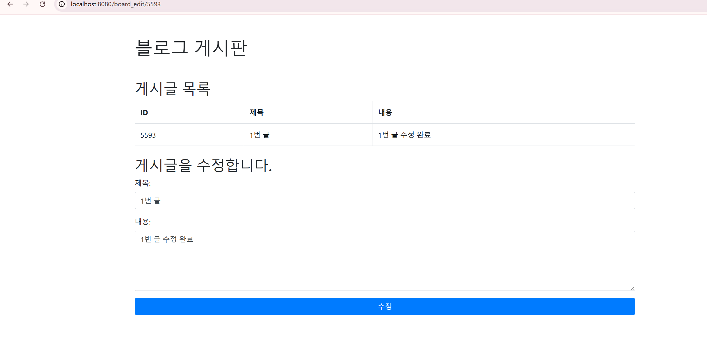

삭제
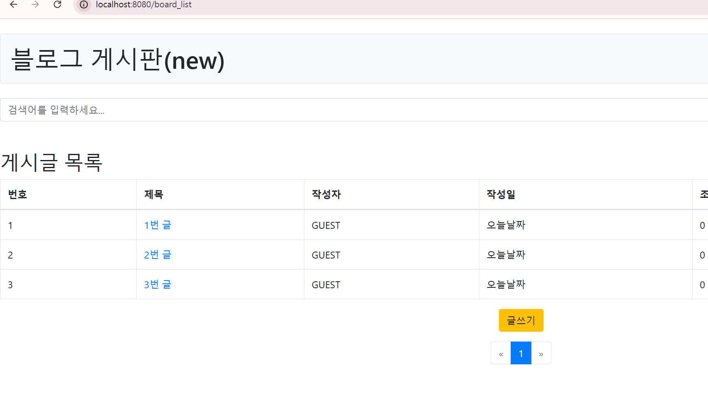
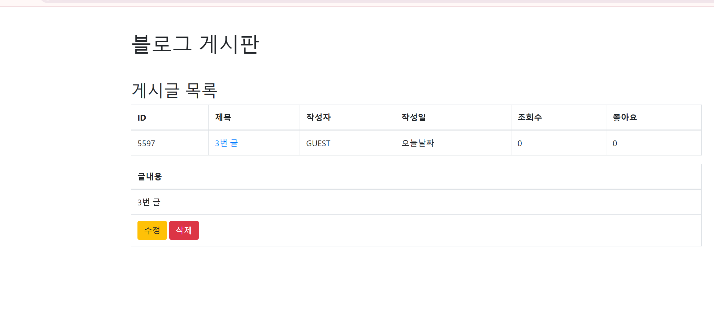

삭제 후(2번글 삭제제)
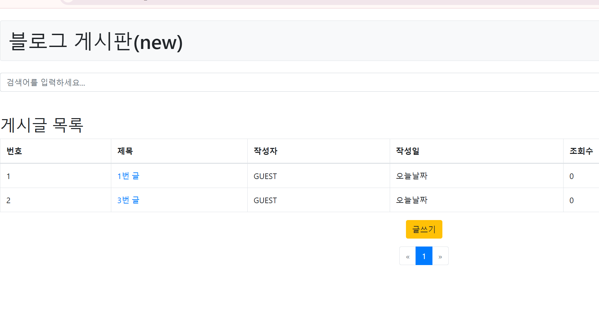

#8주차 수업 완료 + 추가 문제 구현 완료

글 번호 (완료)
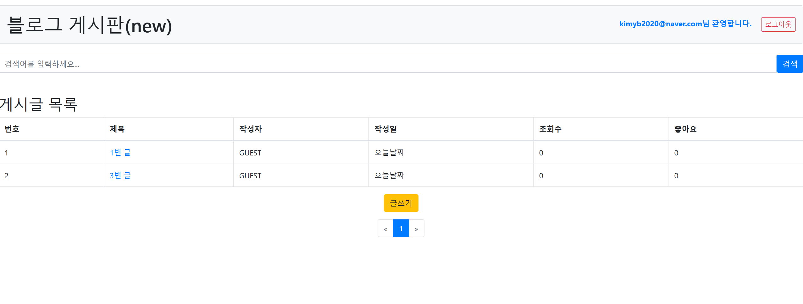

삭제 (7주차 완료)

#9주차 수업 완료 + 추가 문제 구현 완료

입력값 필터링
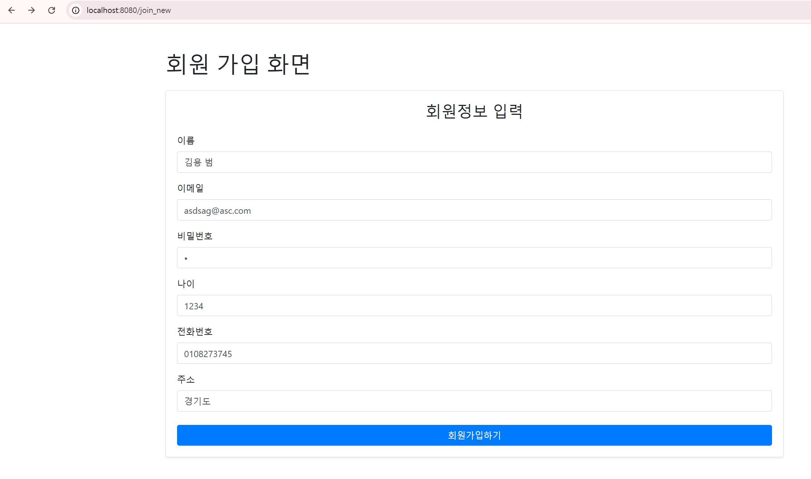
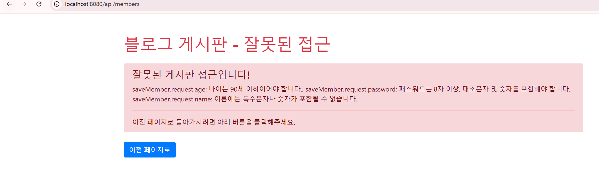

#10주차 수업 완료 + 추가 문제 구현 실패...

#11주차 수업 완료 + 추가 문제 구현 실패 ...